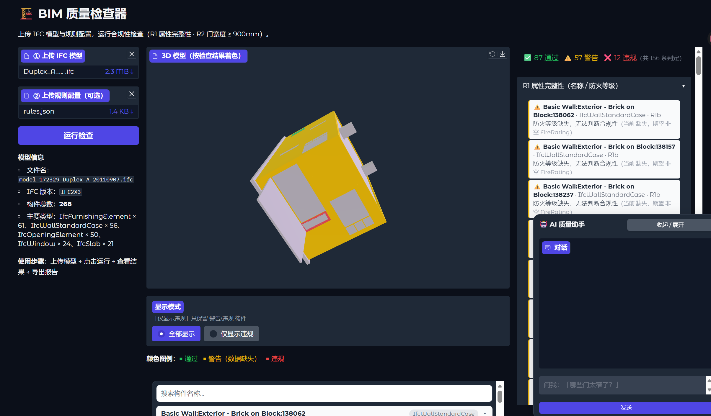

# 🏗️ BIM 质量检查器（AI Agent Web 原型）

一个基于 Web 的微型原型，对建筑 IFC 模型执行**合规性检查**，并内置 **AI 质量助手**，可解释检查结果、在确认后引导修复模型属性。
>
> 提交物：GitHub 仓库（代码 + prompts）· 演示视频 · 单页简历。

## 1. 项目简介

上传 IFC 模型 → 点击运行 → 右侧面板列出全部判定、3D 查看器按结果着色 → 与 AI 助手对话问答或修复 → 重新检查全绿 → 导出单文件 HTML 报告。

**🎬 演示视频**：[点击观看完整演示（demo.MOV，2 分 53 秒）](demo.MOV) —— GitHub 页面上点击即可在线播放；本地查看时用系统播放器打开。

核心功能：

- **两条检查规则**：R1 属性完整性（名称 / 防火等级）、R2 疏散门宽度（≥ 900 mm），pass / warn / fail 三级判定
- **规则即数据**：规则定义在 `config/rules.json`，可在界面直接上传自定义规则，无需改代码
- **着色 3D 查看器**：每个构件按判定结果着色（绿 / 黄 / 红），支持「仅显示违规」过滤
- **构件属性卡片**：中栏可搜索、可展开查看每个被检查构件的全部属性（GlobalId / 直接属性 / 属性集）
- **AI 质量助手**：浮动聊天面板，支持对检查结果的问答（"哪些疏散门宽度不满足要求？"）与**确认后修复**（"将所有小于 900mm 的门改成 1000mm"→ 真实函数调用 → 自动重检）；接入 DeepSeek LLM（可选），无 API Key 时静默回退为离线确定性问答，演示不依赖任何外部服务
- **单文件 HTML 报告**：一键导出，可离线分享（样例见 [report_sample.html](report_sample.html)）

### 1.1 UI 界面介绍



| 区域 | 功能 |
|---|---|
| **左栏 · 上传区** | ① 上传 IFC 模型（必填）· ② 上传规则配置 JSON（可选，默认用 `config/rules.json`）· 「运行检查」按钮 · 模型信息（文件名 / IFC 版本 / 构件总数与构成） |
| **中栏 · 3D 查看器** | 按判定结果着色的三维模型（绿=通过 · 黄=警告 · 红=违规）；「显示模式」可切换 **全部显示 / 仅显示违规**；下方颜色图例与**构件卡片列表**（搜索框 + 折叠卡片，纯前端交互） |
| **右栏 · 检查结果** | 顶部摘要条 `✅ N 通过 · ⚠️ N 警告 · ❌ N 违规`；下方 R1 / R2 两组折叠结果列表（按违规 → 警告 → 通过排序，每条含构件名、原因、当前值 / 期望值）；「导出 HTML 报告」按钮 |
| **右下角 · AI 质量助手** | 浮动聊天面板（初始折叠，点击「收起 / 展开」打开）：问结果、要建议、确认后执行修复，修复后自动刷新右栏与 3D 视图 |

## 2. 输入数据格式

| 项目 | 说明 |
|---|---|
| 文件格式 | `.ifc`（Industry Foundation Classes） |
| 支持版本 | **IFC 2×3、IFC 4**（按 schema 自动识别，构件提取与属性遍历两版本通用） |
| 检查对象 | `IfcWall`（墙）、`IfcDoor`（门） |
| 规则配置 | `.json`（可选上传，覆盖默认规则；结构见 [第 10 节](#10-配置说明)） |

左侧模型信息区会实时显示所上传文件的 IFC schema 版本与构件统计。

## 3. 技术栈

| 层 | 选型 | 理由 |
|---|---|---|
| 语言 | **Python 3** | IFC 开源生态（IfcOpenShell）以 Python 为主，且便于后续接入 LangChain / Claude Agent 等 AI 技术栈 |
| IFC 引擎 | [**IfcOpenShell**](https://ifcopenshell.org/) | 最成熟的 Python IFC 解析库；`ifcopenshell.api` 支持对模型的**安全属性级修改**（AI 修复的核心能力）；`ifcopenshell.geom` 提供逐构件网格生成 |
| Web UI | [**Gradio**](https://www.gradio.app/) | 纯 Python 构建三栏 Web 界面 + `gr.Model3D` 3D 查看器 + `gr.Chatbot` 聊天，零前端构建，最适合快速原型 |
| 3D 网格 | [**trimesh**](https://trimesh.org/) | 逐构件网格按判定着色、合并导出为 GLB |
| LLM | **DeepSeek API**（OpenAI 兼容协议） | 性价比高、国内网络直连；通过 `openai` SDK 调用，key 由 `.env` 管理；**无 key 时离线确定性兜底** |
| 数值 | numpy | 网格顶点处理 |
| 测试 | pytest | 49 个测试覆盖引擎 / 报告 / 网格 / 端到端 / Agent 闭环 |

## 4. 安装与运行

**环境要求**：Python **≥ 3.8**（推荐 3.10+），Windows / macOS / Linux 均可。

```bash
# 1. 克隆仓库
git clone https://github.com/tokamakkk/hku-ai-bim-quality-checker.git
cd hku-ai-bim-quality-checker

# 2. 安装依赖（建议使用虚拟环境）
python -m venv .venv
# Windows:  .venv\Scripts\activate      macOS/Linux:  source .venv/bin/activate
pip install -r requirements.txt

# 3.（可选）配置 DeepSeek API Key —— 不配置也能完整使用，Agent 走离线问答
cp .env.example .env        # Windows: copy .env.example .env
# 编辑 .env 填入 DEEPSEEK_API_KEY

# 4. 启动
python src/app.py           # 浏览器访问 http://127.0.0.1:7860（固定端口）
```

如需临时公网分享链接（方便演示给他人）：

```bash
GRADIO_SHARE=1 python src/app.py
```

> 注：share 页面会从境外 CDN 加载 JS，受限网络下可能白屏，故默认关闭。

**运行测试**（可选）：

```bash
pytest tests/ -v            # 49 tests：引擎、§8.1 样例验收、报告、GLB 颜色、端到端 + Agent 修复闭环
```

## 5. 规则说明

### 5.1 选用了什么规则？为什么选这两条？

按照题目「仅实现 1–2 条规则，优先简洁」的要求，从题目建议的示例中选取了**两条不同类型**的规则：

1. **R1 属性完整性**（IfcWall / IfcDoor 的 `Name` 与 `FireRating`）—— 数据质量问题
2. **R2 疏散门宽度**（IfcDoor 的 `OverallWidth ≥ 900 mm`）—— 规范合规问题

选择理由：

- **贴合真实痛点**：实际工程中 Revit 等工具导出 IFC 后丢失构件名称、防火等级藏在厂商属性集里，是质检中最常见的两类问题（"BIM 模型能不能用"与"是否满足消防规范"）
- **两类检查形态各覆盖其一**：R1 是「属性存在性」检查，R2 是「数值阈值」检查 —— 用两条规则即可验证规则引擎的通用性（`non_empty` 与 `range` 两类条件），而不是两条规则用同一种写法
- **R2 有明确规范依据**：门宽度直接对应 GB 50016 的强制条文，是"真合规检查"而非演示性规则

### 5.2 R1 属性完整性检查（IfcWall / IfcDoor）

| 子检查 | 检查内容 | pass | warn | fail |
|---|---|---|---|---|
| **R1a Name** | `Name` 直接属性非空 | 名称存在且非空 | — | 为空 / 缺失（构件无标识，影响管理、对账与算量） |
| **R1b FireRating** | 遍历构件**所有**属性集（标准 + 厂商）查找 `FireRating` | 任一属性集中存在非空值 | **全部属性集均无此属性**（视为"无法判断"而非违规，避免误杀——不同厂商导出的字段位置差异很大） | — |

### 5.3 R2 疏散门宽度检查（IfcDoor）

| 检查内容 | pass | warn | fail |
|---|---|---|---|
| `IfcDoor.OverallWidth`（mm） | ≥ 900 mm | 属性缺失（无法判断） | < 900 mm，如"门宽 800 mm < 900 mm" |

**规范依据**：阈值 900 mm 依据中国 **GB 50016《建筑设计防火规范》**（疏散门净宽 ≥ 0.9 m）；美国 IBC 对应值为 813 mm（32 in）。该阈值是 `config/rules.json` 中的**规则参数**（`min: 0.9`，单位 m），修改配置即可适配不同司法辖区，无需改代码。

## 6. 设计简化与假设

以下为简化说明（完整版见 [doc/DESIGN.md](doc/DESIGN.md) §4.4 / §7）：

- **R2 采用名义宽度而非净宽度**：`IfcDoor.OverallWidth` 是门洞宽度，扣除门扇与门框后的实际通行净宽会更小。原型将其作为净宽的可记录代理指标（proxy）使用。
- **`FireRating` 遍历全部属性集**：它不是 IfcWall / IfcDoor 的直接属性，而是经由 `IsDefinedBy → IfcRelDefinesByProperties` 挂接的属性集属性。不同导出器的存放位置（`Pset_DoorCommon`、`Pset_Revit_...` 等）差异极大，因此检查器遍历**每一个**属性集并取第一个非空值。
- **IFC 中没有"疏散门"的原生概念**：默认对所有 IfcDoor 执行检查；带 `Pset_DoorCommon.FireExit = true` 的门被单独标记为 `EXIT` 分组，为将来施加更严格阈值预留。
- **检查范围仅限 IfcWall / IfcDoor**（两条规则的目标实体），其他构件类型不参与判定。

## 7. 示例测试数据

**`sample_data/` 目录**：

| 文件 | 说明 |
|---|---|
| `good_model.ifc` | 健康基线模型 —— 全部判定绿色（pass） |
| `bad_model.ifc` | 验收演示模型（2 面墙 + 4 扇门）—— 共 16 条判定，**5 个问题：4 fail / 1 warn**（空名称墙、缺防火等级、3 扇窄门 800 / 700 / 800 mm，其中 1 扇带 FireExit 标记）；右栏摘要应为 `✅ 11 通过 · ⚠️ 1 警告 · ❌ 4 违规` |
| `Duplex_A_20110907.ifc` | 公开真实住宅模型（IFC 2×3，开源样例），用于验证真实数据下的表现 |
| `walls.ifc` / `voids.ifc` | 几何测试用的小模型 |
| `06B-COBie_Test-stage6-COBie - Delivered.xlsx` | 参考数据文件（COBie 交接测试样例） |

两个合成模型可用 `python generate_models.py` 重新生成。

**`config/` 目录**：`rules.json` —— 默认的两条规则定义（JSON，可在界面直接上传自定义版本覆盖）。

## 8. 项目结构

```
├── config/
│   └── rules.json              # 2 条规则（JSON 数据，可上传替换）
├── prompts/                    # Agent 系统提示词 / 工具 schema / 上下文构建器（题目要求提交 prompts）
├── sample_data/                # 示例 IFC 模型（见第 7 节）
├── screenshot/                 # 界面截图
├── doc/
│   └── DESIGN.md               # 完整设计文档（架构、验收口径、Agent 设计）
├── src/
│   ├── app.py                  # Gradio 主程序（三栏 UI + AI 助手），服务器入口
│   ├── core/                   # 检查引擎：engine.py（规则引擎）/ rules_impl.py
│   │                           #   / ifc_utils.py（构件与属性提取）/ verdict.py（判定数据模型）
│   ├── viz/                    # mesh_exporter.py（按判定着色的 GLB 导出）
│   ├── report/                 # report_html.py（单文件 HTML 报告）
│   └── agent/                  # LLM Agent（问答 + 修复工具 + DeepSeek 调用与离线兜底）
├── tests/                      # pytest：引擎 / 报告 / 网格 / 端到端 + 修复闭环 / Agent 上下文
├── generate_models.py          # 重新生成 good/bad 两个示例模型
├── report_sample.html          # 报告输出样例（单文件，浏览器直接打开）
├── requirements.txt
└── .env.example                # DeepSeek API Key 配置模板（.env 已被 gitignore）
```

## 9. 使用截图

**主界面**（上传模型 → 运行检查 → 结果着色与判定列表 → AI 助手对话）：


**导出的 HTML 报告样例**：点击打开 [report_sample.html](report_sample.html)（单文件，含模型摘要、规则配置、全部判定与统一配色），下载后在浏览器中即可查看。

## 10. 配置说明

规则完全由 `config/rules.json` 定义（结构沿用自开源项目 BQC 的 config-driven 思路），修改后可在界面「② 上传规则配置」中上传，或直接替换默认文件：

```json
{
  "validation_rules": [
    {
      "name": "R1 Attribute Completeness",
      "entity": ["IfcWall", "IfcDoor"],      // 检查目标实体
      "file_format": [".ifc"],
      "checks": [
        { "name": "R1a Name present", "attribute": "Name",
          "condition": { "type": "non_empty" } },                      // 存在性检查
        { "name": "R1b FireRating present", "attribute": "FireRating",
          "condition": { "type": "non_empty", "source": "pset_any",
                         "severity": "warn" } }                        // 遍历所有属性集，warn 级
      ]
    },
    {
      "name": "R2 Exit Door Width",
      "entity": ["IfcDoor"],
      "checks": [
        { "name": "R2 Door width", "attribute": "OverallWidth",
          "condition": { "type": "range", "min": 0.9, "unit": "m",
                         "missing": "warn",                            // 属性缺失 → warn
                         "threshold_basis": "GB50016 / IBC 813mm" } }
      ]
    }
  ]
}
```

常见修改示例：

- **调整门宽阈值**：把 `"min": 0.9` 改为 `0.813`（IBC 32 in）或 `1.0`
- **调整严重级别**：把 R1b 的 `"severity": "warn"` 改为 `"fail"`，或将 R2 的 `"missing": "warn"` 改为 `"fail"`
- **扩展检查对象**：在 `"entity"` 数组中增加实体名（如 `"IfcWindow"`）
- **新增子检查**：在 `"checks"` 中追加 `non_empty` 或 `range` 条件

## 11. 设计参考与引用

本项目复用了开源项目 **BIM Quality Checker (BQC)**（T. Kang, MIT License）中久经考验的设计模式，特此致谢：

- **配置驱动的规则引擎**：`validation_rules` JSON + 类型化条件（`range` / `non_empty`），规则即数据、增删规则不动代码
- **属性集遍历辅助**：构件直接属性与全部属性集扁平化为查找表
- **按判定着色的 GLB 导出**：`ifcopenshell.geom` 逐构件网格 + trimesh 合并逐面着色 → `gr.Model3D`

详细出处与采用理由见 [doc/DESIGN.md](doc/DESIGN.md) §4.4。同时感谢 [IfcOpenShell](https://ifcopenshell.org/)、[Gradio](https://www.gradio.app/)、[trimesh](https://trimesh.org/) 与 [buildingSMART IFC](https://technical.buildingsmart.org/standards/ifc/) 社区。

## 12. 局限性

当前版本明确**不做**以下事情（保持 1–2 条规则的精简定位）：

- ❌ **几何碰撞检测**（墙 / 梁 / 管道冲突）
- ❌ **自定义规则语言 / 规则编辑器**（规则仅限 JSON 中预定义的条件类型）
- ❌ **Revit / AutoCAD / JSON 等非 IFC 输入**
- ❌ **房间到出口的通行距离、楼梯、消防分区等更复杂的消防检查**
- ❌ **几何级修复**：Agent 修复仅限属性级（名称、防火等级、门宽），不修改构件几何
- ❌ **净宽度精确计算**：R2 以名义宽度为代理（见第 6 节）
- ❌ **多用户 / 云端部署 / 数据持久化**：单机本地运行，无账号与历史记录
- ❌ **PDF / Excel 报告**：仅输出单文件 HTML 报告
