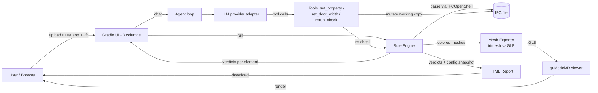

# Design Document — BIM Quality Checker (AI-Agent Web Prototype)

**Project**: Web-based micro prototype / agent that performs basic compliance and soundness checks on architectural models (IFC)
**Context**: HKU AI Agent Technical Test — 1–2 check rules, 3 deliverables, deadline **2026-08-31 23:59 (HKT)**
**Document version**: v1.0 · 2026-08-29

---

## 1. Background & Objectives

### 1.1 Task brief
Build a web-based micro prototype or smart agent within 7 days that runs basic compliance / soundness checks on an architectural model. Implement only 1–2 rules; prioritize simplicity. Deliverables:

| # | Deliverable | Requirement |
|---|---|---|
| 1 | GitHub repository | Must contain **code and prompts** |
| 2 | Demo / explanation video | < 3 minutes, shareable link |
| 3 | Single-page resume | Updated, **GPA clearly listed for each degree** |
| 4 | Email submission | To junnaiffj@hku.hk, subject `【香港大学人工智能代理技术测试】大学名称` |

### 1.2 Design goals (mapped to evaluation criteria)

| Evaluation criterion | Our translation into engineering decisions |
|---|---|
| 实用 (practical) | Two rules that catch real, explainable defects; results are actionable (element + value + expected + reason) |
| 周到 (thoughtful) | Three-tier verdicts (pass / warn / fail) instead of binary; guardrails on the LLM; explicit non-goals to prevent scope creep |
| 美观 (aesthetic) | One consistent color language across UI, 3D viewer, and report; three-column layout; polished empty/loading states |
| Engineering judgment | Every rule cites a standard and states its simplification (e.g. nominal vs clear door width); architecture reuses proven open-source patterns |

### 1.3 Design principles
1. **The rule is the product.** 1–2 rules done rigorously beat 5 rules done sloppily. The rule's semantic (what counts as a violation, what "cannot judge" means) is designed before the UI.
2. **Rules are data, not code.** Rules live in a JSON configuration consumed by a generic engine — same pattern as the open-source BQC project this design borrows from. Adding/retuning a rule never touches Python.
3. **Demo-story-driven.** The demo video is the deliverable that matters most (evaluators watch ≤3 min). Development is ordered so that a coherent story ("bad model → check → agent fixes → re-check passes → export report") is available as early as possible.
4. **Reuse before build.** Well-trodden OSS patterns (IFCOpenShell, config-driven rule engines, trimesh→GLB viewers) are adopted as-is where they fit, so the ~3 working days available go into product decisions, not plumbing.

---

## 2. Scope: the Rules (locked)

### 2.1 R1 — Attribute Completeness (IfcWall, IfcDoor)

> **"A model element without its identity or its compliance-critical properties is not yet a model element."**

Checks (2 sub-checks, per element):

| Sub-check | Target | Verdict logic | Severity |
|---|---|---|---|
| R1a | `Name` (direct attribute) | empty/None → **fail** | Red |
| R1b | `FireRating` (pset property) | property missing or empty across **all** psets → **warn** (cannot judge); present → pass | Yellow |

**IFC mechanism (important IFC detail):**
`FireRating` is **not** a direct attribute of `IfcWall`/`IfcDoor`. It lives inside property sets reachable via:
```
element.IsDefinedBy → IfcRelDefinesByProperties.RelatingPropertyDefinition
  → IfcPropertySet (e.g. Pset_WallCommon, Pset_DoorCommon, or vendor psets)
  → IfcPropertySingleValue "FireRating"
```
The checker traverses **every** pset attached to the element and accepts the **first non-empty** `FireRating` value — because Revit/ArchiCAD exports often put it in vendor-specific psets (`Pset_Revit_...`), not only the standard ones. Falling back across psets is the difference between a checker that works on real files and one that works on the sample.

### 2.2 R2 — Exit Door Width (IfcDoor)

> **"Doors that must allow passage must actually be wide enough."**

| Condition | Verdict | Severity |
|---|---|---|
| `OverallWidth` exists and ≥ 900 mm | pass | Green |
| `OverallWidth` exists and < 900 mm | **fail** — "door width 800 mm < 900 mm required" | Red |
| `OverallWidth` missing | **warn** — cannot judge | Yellow |

**Standard basis & engineering simplifications (documented, not hidden):**
- Default threshold **900 mm** follows China's **GB 50016** (疏散门净宽 ≥ 0.9 m for most public occupancies); the US IBC equivalent is 813 mm (32 in). The threshold is a **configurable rule parameter** in the rules JSON, so the same engine serves either jurisdiction.
- The prototype checks **nominal overall width** (`IfcDoor.OverallWidth`, the opening width) as a proxy for **clear width** (actual pass-through width after the leaf and frame are accounted). README states this simplification explicitly.
- "Exit doors" have no native concept in IFC 2×3. Default behavior: check **all** IfcDoor. If a door carries `Pset_DoorCommon.FireExit = true` (IFC4), it is grouped and flagged with "EXIT" so a stricter threshold could apply later. This keeps the rule robust across IFC versions.

### 2.3 Why these two rules
- Both target **model soundness + basic code compliance** — the two things evaluators named first.
- Both are **verifiable by a human in seconds** on a rendered model (a narrow door is visible; an unlabeled wall is visible), which makes the visualization ↔ verdict link trustworthy.
- Both are **cheap to implement** on top of IFCOpenShell (no geometry, no pathfinding) — low risk for a 3-day budget.

### 2.4 Explicit non-goals (anti-scope-creep)

| Not doing | Why |
|---|---|
| Clash detection | Already demonstrated in the borrowed OSS base; geometry work, no demo value for this submission. Mentioned in README as future work only. |
| Custom rule code / rule language | "Upload rules" = upload a **rules JSON config**. Extending condition types is a code change, not a user feature. |
| 3rd rule of any kind | The brief rewards 1–2 rules done well. |
| Revit / AutoCAD / LandXML input | IFC only. One input format = one robust pipeline. |
| Multi-user, auth, cloud deployment | Runs locally on `localhost` for the demo. |
| Mobile / i18n / theming | Desktop-first; UI language fixed to **Chinese** (no i18n). |
| Geometry editing in viewer | Out of scope; agent edits **attributes only** (see §6). |
| PDF / Excel report | Single-file **HTML** report only (plus JSON for machine use). |

---

## 3. Input Data & Test Models

### 3.1 Input format
- **IFC STEP files** (.ifc), schema 2×3 and IFC4, read via **IFCOpenShell**.
- **Rules configuration**: JSON file (same shape as the engine's `validation_rules`).

### 3.2 Test models: synthetic, deliberately defective

Public samples (e.g. the buildingSMART Duplex Apartment) are rejected as demo material: too large for a browser viewer, and they contain no planted defects to talk about. Instead we **generate** two small models (~10 elements each, a one-bedroom apartment) with `ifcopenshell.api`:

| Model | Purpose | Planted defects |
|---|---|---|
| `good_model.ifc` | Baseline "healthy" model | none — every wall named, every door has FireRating, all doors ≥ 900 mm |
| `bad_model.ifc` | Demo protagonist | ① wall with empty `Name`; ② door missing `FireRating`; ③ door 800 mm; ④ door 700 mm; ⑤ door marked FireExit but 800 mm |

The defect set maps 1:1 to the verdict tiers: two **fails**, one **warn**, and one **exit-flagged fail** — a complete tour of the result semantics in a single model.

---

## 4. System Architecture

### 4.1 Stack

| Layer | Choice | Rationale |
|---|---|---|
| Language | Python 3 | IFCOpenShell ecosystem |
| IFC parsing | `ifcopenshell` (+ `ifcopenshell.api` for agent edits) | De-facto standard, also handles model *generation* for test data |
| Web UI | **Gradio** (`gr.Blocks`) | 3-column layout, file upload, `gr.Model3D` viewer, `gr.Chatbot` all built in; days saved vs a custom frontend |
| 3D viewer | `trimesh` → GLB → `gr.Model3D` | Meshes colored **per-element by verdict** before export (borrowed from BQC) |
| Report | HTML single-file (embedded CSS/JS) | Shareable, printable, no runtime deps |
| LLM | **DeepSeek API** (OpenAI-compatible), model `deepseek-v4-flash-vision-exp`, key via `DEEPSEEK_API_KEY`; thin adapter kept for fallback (Claude / Ollama) | Primary vendor locked; video never depends on a single API |

**Single-process design**: the Gradio app *is* the server. No FastAPI/React split. This is deliberate: 3-day budget, one entry point (`python app.py`), one port, trivially demonstrable.

### 4.2 Component diagram



### 4.3 Data flow (check pipeline)

```
upload -> save to working dir
       -> ifcopenshell.open(file)
       -> engine iterates rules -> per element:
            extract direct attrs + traverse psets (R1)
            read OverallWidth in mm (R2)
       -> emit Verdict{element_guid, element_name, ifc_type, check_id,
                       status: pass|warn|fail, current_value, expected,
                       reason}
       -> consumers:  UI cards / colored GLB / HTML report / agent context
```

### 4.4 Design heritage (patterns borrowed, with attribution)
This design reuses battle-tested approaches from the open-source **BIM Quality Checker (BQC)** project (MIT, by T. Kang):
- **Config-driven rule engine**: `validation_rules` JSON with typed conditions (`range`, `non_empty`, `list`, …) — rules as data.
- **Pset traversal helper** (`get_ifc_property_set`-style): flatten element attributes + property sets into a lookup table.
- **Colored GLB export**: `ifcopenshell.geom` per-element meshes merged via trimesh with per-face colors → `gr.Model3D`.

Reuse is visible in code comments/README, which also demonstrates engineering judgment (adopting proven patterns vs. reinventing).

---

## 5. UI/UX Design

### 5.1 Layout (three columns, as specified)

```
┌──────────────┬────────────────────────────┬───────────────────────────┐
│ LEFT         │ CENTER                    │ RIGHT                     │
│ Uploads      │ BIM Viewer                │ Review Results            │
│              │                           │                           │
│ • Rules JSON │  ┌──────────────────────┐ │  Summary bar:             │
│   upload     │  │  3D model (GLB)      │ │  ● 12  ● 3  ● 2   (17)    │
│ • .ifc file  │  │  colored by verdict  │ │  [filter: all|warn|fail]  │
│   upload     │  │  + color legend      │ │                           │
│ • [Run]      │  └──────────────────────┘ │  R1 Attribute completeness│
│              │  [ ] show violations only │  ├─ 6 passed · 1 fail     │
│ Model info:  │                           │  └─ wall/01 · Name empty   │
│ file, schema,│                           │  R2 Door width            │
│ element count│                           │  ├─ 4 passed · 2 fail     │
│              │                           │  └─ door/04 · 800mm < 900 │
└──────────────┴────────────────────────────┴───────────────────────────┘
                     ·  floating robot button (bottom-right) opens chat ·
```

*All user-facing copy is Chinese; labels above are English placeholders for document readability.*

*Right column is an independent scroll region (`#results-column`, height ≈ `100vh − 150px`, clamped 340–900px): long result lists scroll inside the column instead of growing the page.*

### 5.2 Color language (one system, three surfaces)

| Status | UI card | 3D mesh | Report |
|---|---|---|---|
| Pass | green left-border card | element tinted green | ✓ row |
| Warn (cannot judge) | amber | tinted amber | ⚠ row with "data gap" tag |
| Fail | red | tinted red | ✗ row, bold value |

Same tokens everywhere — the evaluator can point at the model, the card, and the report and see the same story. The viewer carries a persistent legend.

### 5.3 Interaction specifics
- **Viewer**: verdict-colored full model by default; a **"show violations only"** toggle re-exports a GLB containing only warn/fail elements (cheap: same exporter, filtered) — this is the "locate the problem" gesture. (Interactive click-to-fly is explicitly **stretch**, not committed.)
- **Right panel**: summary bar with counts per tier; rule cards expandable to element rows; rows show `element name · type · GUID · current value → expected · reason`; filter by tier; each row is copyable so the user can paste it into the chat to ask for a fix.
- **Empty & loading states**: "upload a model to begin" placeholder; spinner + progress text during check (mesh extraction is the slow step); error toasts on unsupported files.
- **Chat (floating robot button)**: bottom-right square button with robot glyph; click slides up a chat panel (auto-height); suggested starter prompts ("哪些门不符合宽度要求？", "把所有小于 900mm 的门改成 1000mm"); messages show which tool ran and its result.

### 5.4 Accessibility / thoughtfulness
- Upload hints list accepted formats and where to find the sample models.
- First-run guide: a 3-step "Instruct" card (upload rules → upload model → Run), retained from the borrowed base's habit of always showing instructions.

---

## 6. LLM Agent

Two capabilities, one chat window. Both are bounded — the agent is a **narrow helper**, not an open-ended BIM manipulator.

### 6.1 Capability A — Project Q&A (read-only)
Context injected per turn: compact element table (guid, name, type, width, fire rating, verdicts — truncated to the most relevant N rows by severity) + the rules in force + check summary. Answers questions like "Which doors are too narrow?" / "What did R1 flag and why?" No tool calls required; deterministic, cheap, and the guaranteed-working half of the demo.

### 6.2 Capability B — Guided fixes (3 narrow tools)

| Tool | Signature | Guardrail |
|---|---|---|
| `set_property` | `(guid, property, value)` | `property` allowlisted to `Name`, `FireRating` |
| `set_door_width` | `(guid, width_mm)` | clamps to [600, 3000]; only touches `IfcDoor.OverallWidth` |
| `rerun_check` | `()` | re-runs engine, refreshes cards/viewer/report |

**Workflow**: user asks in natural language → LLM extracts intent + args → tool executes on a **working copy** of the file (never the original upload; originals are re-uploadable, which serves as undo) → `rerun_check()` auto-fires → the UI reflects the new verdicts. The demo beat "tell the agent to fix the doors → re-check shows green" is the product's climax and must work end-to-end before anything is polished.

**Hard guardrails** (also documented in README as engineering judgment):
- No element deletion, no geometry edits, no pset creation — attributes on existing elements only.
- All edits are attribute-level; a malformed tool call returns an error message the LLM must relay, it does not fail silently.

### 6.3 Provider (locked)
- **Primary: DeepSeek API** — OpenAI-compatible chat completions (`https://api.deepseek.com`), model **`deepseek-v4-flash-vision-exp`**, API key via `DEEPSEEK_API_KEY` env var.
- A thin `Provider` adapter interface is retained solely so a fallback (Claude / local Ollama) can be swapped in if the primary API is unreachable on recording day — DeepSeek is the default in code, config, and the demo.

### 6.4 Prompts as first-class artifacts
System prompt, tool schemas, and the context-builder are committed under `prompts/` — the brief explicitly requires **prompts in the repository**. Versioned alongside code so the video and the repo tell the same story.

---

## 7. Reporting & "Genuinely useful" Visualization

### 7.1 Verdict data model (the single source of truth)

```
Verdict {
  element_guid, element_name, ifc_type,
  check_id,              # "R1a", "R1b", "R2"
  status,                # pass | warn | fail
  current_value, expected,   # e.g. "800 mm" / "≥ 900 mm"
  reason                 # "door width 800 mm < 900 mm required"
}
```

Everything (cards, GLB colors, chat context, report) derives from this list. One format, zero drift between surfaces.

### 7.2 Why the three tiers are "useful" and not decorative
- **fail** = the model is non-compliant → actionable.
- **warn** = data gap, cannot judge → tells the author the *model* is incomplete, not just non-compliant (this is the attribute-completeness rule's real message).
- **pass** = evidence-based green, not assumed green.

### 7.3 HTML report (single file)
Contents: project metadata · model summary (file name, IFC schema, element counts by type, check timestamp) · **summary bar** (pass/warn/fail counts + per-rule distribution) · full verdict table (all fields, filterable/sortable client-side) · rules configuration snapshot (what was checked, with thresholds) · footer. One self-contained `.html` — opens anywhere, printable to PDF if the reviewer wants.

---

## 8. Testing & Acceptance

### 8.1 Rule engine (automated smoke tests)
| Input | Expected |
|---|---|
| `good_model.ifc` | R1: 0 fails · R2: 0 fails, 0 warns |
| `bad_model.ifc` | R1: exactly 1 fail (empty Name) + 1 warn (missing FireRating) · R2: exactly 3 fails (800 / 700 / 800 mm), including 1 exit-flagged door · total 5 findings (4 fail / 1 warn) |

`pytest` suite runs these against the real engine with a 30-line rules config.

### 8.2 Agent (manual acceptance script, recorded for the video)
1. Upload `bad_model.ifc` → 点击运行 → 右侧显示 5 条结果（4 fail / 1 warn）。
2. 对话：*"哪些门太窄了？"* → agent 列出 03、04、05 号门及其宽度。
3. 对话：*"把小于 900mm 的门都改成 1000mm"* → 两次 `set_door_width` 调用，工作副本已保存。
4. 对话：*"重新运行检查"* → R2 全绿；viewer 重新着色；报告重新导出。

### 8.3 Manual QA checklist (before recording)
Layout renders at 1366×768 · viewer loads < 3 s on both sample models · every surface uses the same color tokens · LLM calls succeed on the chosen provider · report opens from a fresh download.

---

## 9. Delivery Plan (compressed to ~3 working days)

> The brief's 7-day allowance is already partially consumed; the hard deadline is 2026-08-31 23:59. Every P1 item below is droppable without breaking the demo story.

> Re-based 2026-08-30: decisions (provider, UI language) locked on 8/29 evening; the 8/29 backlog moves into today.

| Day | P0 (must) | P1 (if time) |
|---|---|---|
| **8/30** | Generate good/bad models · rules JSON · engine + pytest green · 3-column UI skeleton · colored GLB + toggle · HTML report · Capability A (Q&A) | UI polish, filter interactions |
| **8/31 AM** | Capability B (tools + rerun loop) · README (architecture, rule basis, simplifications) · prompts/ committed | — |
| **8/31 PM** | Record video (≤3 min) · update single-page resume (GPA per degree) · push GitHub · send email (subject `【香港大学人工智能代理技术测试】大学名称`) | — |

### 9.1 Demo video script (≤ 3:00, storyboard)

**Narration language: Chinese** (matches the UI).
| Time | Beat |
|---|---|
| 0:00–0:30 | Why: model data completeness + door compliance matter; what was built (1 rule engine, 2 rules) |
| 0:30–2:15 | Demo: upload bad model → Run → findings appear in cards + 3D colors → chat with agent → fixes applied → re-check green → export HTML report |
| 2:15–3:00 | Architecture in 5 bullets (config-driven engine, IFCOpenShell, colored-mesh viewer, narrow tool agent, HTML report) + simplifications stated honestly (nominal vs clear width) |

### 9.2 Submission checklist
- [ ] GitHub repo: code + `prompts/` + README + DESIGN.md + sample models
- [ ] Video < 3 min, public link (YouTube/Bilibili)
- [ ] Single-page resume with GPA per degree (undergrad & grad)
- [ ] Email to junnaiffj@hku.hk, subject `【香港大学人工智能代理技术测试】大学名称`, before 23:59

---

## 10. Risks & Mitigations

| Risk | Impact | Mitigation |
|---|---|---|
| LLM API unavailable/slow during recording | Video ruined | DeepSeek primary + adapter fallback; Capability A works without tools; pre-rehearsed transcript as fallback narration |
| Viewer perf on sample models | Laggy demo | Synthetic models are ~10 elements; GLB export is the only slow step (spinner covers it) |
| Scope creep | Deadline miss | Non-goals table (§2.4) + P0/P1 split (§9); anything not in the table is a no |
| Agent tool calls mis-parse intent | Demo derails | 3 narrow tools + strict schemas; LLM relays errors instead of failing silently |
| IFC vendor-pset variance breaks FireRating check | False "warn" storm | Traverse all psets, first non-empty wins (§2.1) |

---

## Appendix A — rules.json (sketch)

```json
{
  "validation_rules": [
    {
      "name": "R1 Attribute Completeness",
      "entity": ["IfcWall", "IfcDoor"],
      "file_format": [".ifc"],
      "checks": [
        { "name": "R1a Name present",   "attribute": "Name",       "condition": { "type": "non_empty" } },
        { "name": "R1b FireRating present", "attribute": "FireRating",
          "condition": { "type": "non_empty", "source": "pset_any", "severity": "warn" } }
      ]
    },
    {
      "name": "R2 Exit Door Width",
      "entity": ["IfcDoor"],
      "file_format": [".ifc"],
      "checks": [
        { "name": "R2 Door width", "attribute": "OverallWidth",
          "condition": { "type": "range", "min": 0.9, "unit": "m",
                         "missing": "warn", "threshold_basis": "GB50016 / IBC 813mm" } }
      ]
    }
  ]
}
```

## Appendix B — Repository layout

```
bim-quality-checker/
├── README.md               # what/why/how + simplifications + credits
├── DESIGN.md               # this document
├── config/rules.json
├── prompts/                # agent system prompt, tool schemas, context builder
├── sample_data/            # good_model.ifc, bad_model.ifc, walls.ifc, voids.ifc
├── src/
│   ├── app.py              # Gradio UI (3 columns + chat)
│   ├── core/               # engine.py, rules_impl.py, ifc_utils.py, verdict.py
│   ├── viz/                # mesh_exporter.py (colored GLB)
│   ├── report/             # report_html.py
│   └── agent/              # provider.py, tools.py, context.py
└── tests/                  # smoke tests on sample models
```
